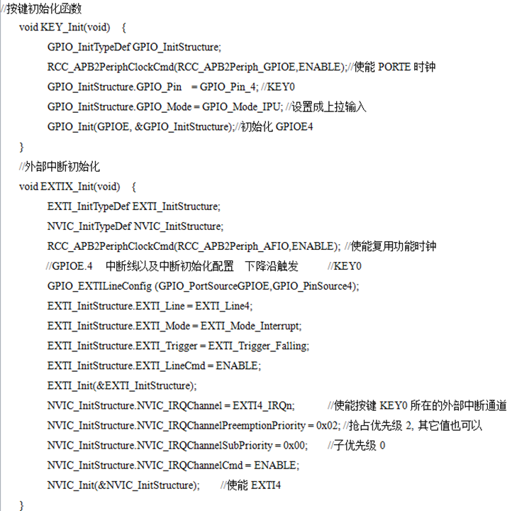
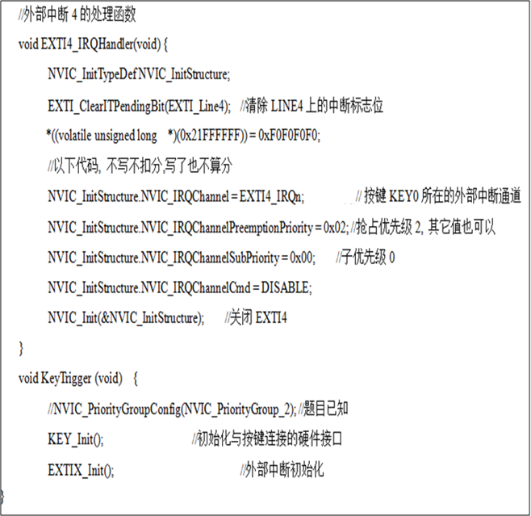

# 单片机题库

## 判断题

### 1、 单片机最小系统，就是实现同样功能的前提下，使用最少数量的元器件实现的系统。

**正确答案：❌**


### 2、 MDK和JDK软件都可以用来开发STM32的程序。

**正确答案：❌**


### 3、 为了更高效地开发复杂应用，我们可以在STM32系列单片机上移植Embedded Linux操作系统，借助操作系统的多任务管理及硬件驱动程序等能力来减轻开发任务。

**正确答案：❌**


### 4、 STM32系列单片机的VDD电压是5V，与51系列单片机一样。

**正确答案：❌**


### 5、 今天的计算机，尽管形态各异，本质上都是图灵机模型的一个技术实现，因此它们都具有相同的理论计算能力。

**正确答案：✅**


### 6、 ARM单片机具有成本低、功耗小、功能强的优势，它们都是ARM公司设计的。

**正确答案：❌**


### 7、 STM32单片机为每个（片内）外设都配备了外设时钟的开关，当我们不使用某个外设时，可以把这个外设时钟关闭，从而降低STM32的整体功耗；当使用外设时，第一个步骤就是开启这个外设时钟。

**正确答案：✅**


### 8、 ARM Cortex-M3 MCU支持的低功耗模式中，待机模式的功耗最低。

**正确答案：✅**


### 9、 STM32单片机的系统复位，引发的事件可能是：外部异步复位引脚上的复位、窗口看门狗计数终止、独立看门狗计数终止、低功耗管理复位、软件复位。

**正确答案：✅**


### 10、 STM32系列单片机虽然定位在中低级成本的控制器类应用，但它们也支持操作系统，例如：MDK RTX、uCOS-II、Embedded Linux等。

**正确答案：❌**


### 11、 STM32系列MCU的电压范围是2.0-3.6V。

**正确答案：✅**


### 12、 嵌入式系统可以用单片机实现，也可以用其它可编程的电子器件实现，嵌入式系统是一个大类，单片机系统是其中一个重要的子类。

**正确答案：✅**


### 13、 单片机电源引脚要接电容，主要是处理两种问题：1）滤除外界辐射的高频干扰；2）滤除单片机工作时自身产生的脉冲干扰。

**正确答案：✅**


### 14、 STM32单片机的系统复位将清除所有寄存器。

**正确答案：❌**


### 15、 JDK软件可以用来开发STM32的程序。

**正确答案：❌**


### 16、 Cortex-M3处理器退出复位后，就从零地址开始执行启动程序。

**正确答案：❌**


### 17、 当Contex-M3处理器工作在Thread模式下，代码一定是非特权的。

**正确答案：❌**


### 18、 Cortex-M3的每个I/O引脚可以独立地编程，尽管I/O端口寄存器必须以32位字的方式访问。

**正确答案：✅**


### 19、 在Cortex-M3体系架构中，有了位带操作后，可以使用普通的Load/Store指令来对单一的比特进行读写。

**正确答案：✅**


### 20、 NVIC和处理器内核接口紧密耦合，主要目的是减少延时、高效处理最近发生的中断。

**正确答案：✅**


## 选择题

### 1、 Cortex-M3的通用定时器中，时基单元不包括( )

- A、 计数器寄存器
- B、 预分频器寄存器
- <mark>C、 屏蔽寄存器</mark>
- D、 自动装载寄存器

**正确答案： C**


### 2、 以下叙述正确的是( )

- <mark>A、 Cortex-M3同时支持小端模式和大端模式</mark>
- B、 Cortex-M3只支持小端模式
- C、 Cortex-M3只支持大端模式
- D、 以上均不正确

**正确答案： A**


### 3、 以下哪种不是定时器的计数器模式( )

- A、 向上计数模式
- B、 向下计数模式
- <mark>C、 预分频模式</mark>
- D、 中央对齐模式

**正确答案： C**


### 4、 Cortex-M3使用的堆栈模型是( )

- <mark>A、 向下生长的满栈</mark>
- B、 向上生长的满栈
- C、 向下生长的空栈
- D、 向上生长的空栈

**正确答案： A**


### 5、 关于Cortex-M3的中断，以下叙述错误的是( )

- A、 原则上，Cortex-M3支持3个固定的高优先级和多达256级的可编程优先级
- B、 Cortex-M3将优先级分为抢占优先级和亚优先级
- <mark>C、 中断优先级的数值越大，其优先级越高</mark>
- D、 NVIC支持总共255种异常和中断

**正确答案： C**


### 6、 对于数unsigned char temp=0x8c，执行temp>>n操作，若n为4，那么操作结果为( )

- <mark>A、 0x08</mark>
- B、 0x11
- C、 0x23
- D、 0x04

**正确答案： A**


### 7、 关于MPU，以下叙述错误的是( )

- A、 MPU可以设置存储区段的访问属性
- B、 MPU定义的存储区段可以相互交叠
- <mark>C、 Cortex-M3的MPU共支持12个存储区段</mark>
- D、 MPU能够阻止用户应用程序破坏操作系统使用的数据

**正确答案： C**


### 8、 以下哪种不是Cortex-M3的工作模式和特权等级的组合( )

- <mark>A、 Handler模式+用户级</mark>
- B、 线程模式+特权级
- C、 线程模式+用户级
- D、 Handler模式+特权级

**正确答案： A**


### 9、 Cortex-M3基本定时器的功能包括( ) (1) 四个独立通道，即输入捕获、输出比较、PWM生成、单脉冲模式输出  (2) 使用外部信号控制定时器和定时器互联的同步电路  (3) 16位可编程预分频器  (4) 16位自动重装载累加计数器

- A、 (1)(2)(3)(4)
- B、 (2)(3)(4)
- <mark>C、 (3)(4)</mark>
- D、 (2)(4)

**正确答案： C**


### 10、 以下不是ARM含义的是( )

- <mark>A、 一种高级RISC编程语言</mark>
- B、 一种高级RISC技术
- C、 一个生产高级RISC处理器的公司
- D、 一种高级RISC的处理器

**正确答案： A**


### 11、 AHB是( )

- <mark>A、 高性能总线</mark>
- B、 高速外设总线
- C、 低速外设总线
- D、 低性能总线

**正确答案： A**


### 12、 GPIOx_ODR寄存器是(   )

- <mark>A、 GPIO输出数据寄存器</mark>
- B、 GPIO输入数据寄存器
- C、 GPIO配置寄存器
- D、 GPIO复位寄存器

**正确答案： A**


### 13、 下列通讯方式中，发送和接收是同时进行的是(   )

- <mark>A、 SPI</mark>
- B、 UART
- C、 IIC
- D、 以上均不正确

**正确答案： A**


### 14、 没有捕获/比较功能的定时器是(   )

- <mark>A、 基本定时器</mark>
- B、 通用定时器
- C、 高级定时器
- D、 以上均不正确

**正确答案： A**


### 15、 关于Cortex-M3内核的指令总线和数据总线，下列说法正确的是( )

- <mark>A、 独立的指令总线和数据总线，统一的指令存储空间和数据存储空间</mark>
- B、 统一的指令总线和数据总线，统一的指令存储空间和数据存储空间
- C、 独立的指令总线和数据总线，独立的指令存储空间和数据存储空间
- D、 统一的指令总线和数据总线，独立的指令存储空间和数据存储空间

**正确答案： A**


### 16、 TIM2具备( )位自动装载计数器

- A、 8
- <mark>B、 16</mark>
- C、 32
- D、 64

**正确答案： B**


### 17、 Cortex-M3处理器采用的架构是( )

- A、 v4
- <mark>B、 v7</mark>
- C、 v6
- D、 v5

**正确答案： B**


### 18、 Cortex-M3处理器的寄存器R8代表( )

- A、 链接寄存器
- <mark>B、 通用寄存器</mark>
- C、 程序计数器
- D、 程序状态寄存器

**正确答案： B**


### 19、 SysTick定时器的中断号是( )

- A、 16
- <mark>B、 15</mark>
- C、 14
- D、 13

**正确答案： B**


### 20、 关于中断嵌套，说法正确的是( )

- A、 只要响应优先级不一样就有可能发生中断嵌套
- <mark>B、 只要抢占优先级不一样就有可能发生中断嵌套</mark>
- C、 只有抢占优先级和响应优先级都不一样才有可能发生中断嵌套
- D、 以上说法均不正确

**正确答案： B**


### 21、 冯诺依曼架构和哈佛架构的区别是( )

- <mark>A、 前者不区分指令存储器和数据存储器，而后者区分指令存储器和数据存储器</mark>
- B、 前者区分指令存储器和数据存储器，而后者不区分指令存储器和数据存储器
- C、 前者运算器数据的吞吐能力强，后者运算器数据的吞吐能力弱
- D、 前者运算器数据的吞吐能力弱，后者运算器数据的吞吐能力强

**正确答案： A**


### 22、 ( )异常不是Contex-M3的系统异常

- <mark>A、 Flash</mark>
- B、 NMI
- C、 硬Fault
- D、 Svcall

**正确答案： A**


### 23、 Cortex按照三类典型的嵌入式系统应用，分成三个系列。( )不是这三个系列之一

- <mark>A、 Cortex-E</mark>
- B、 Cortex-M
- C、 Cortex-A
- D、 Cortex-R

**正确答案： A**


### 24、 Cortex-M3拥有( )个通用寄存器

- <mark>A、 16</mark>
- B、 24
- C、 32
- D、 64

**正确答案： A**


### 25、 ( )不是Cortex-M3的Fault类型

- <mark>A、 复位Fault</mark>
- B、 用法Fault
- C、 硬Fault
- D、 总线Fault

**正确答案： A**


### 26、 ( )不属于STM系列MCU所支持的三种低功耗模式

- <mark>A、 溢出模式</mark>
- B、 待机模式
- C、 停机模式
- D、 睡眠模式

**正确答案： A**


### 27、 Cortex-M3处理器的寄存器R3代表( )

- <mark>A、 通用寄存器</mark>
- B、 链接寄存器
- C、 程序计数器
- D、 程序状态寄存器

**正确答案： A**


### 28、 “复位”在异常向量表中的地址偏移是( )

- <mark>A、 4</mark>
- B、 8
- C、 12
- D、 16

**正确答案： A**


### 29、 ARM Cortex-M3采用了( )级流水

- <mark>A、 3</mark>
- B、 4
- C、 5
- D、 6

**正确答案： A**


### 30、 Cortex-3内核的内部数据路径宽度是( )位

- <mark>A、 32</mark>
- B、 16
- C、 8
- D、 64

**正确答案： A**


### 31、 GPIOx_ODR寄存器是(   )

- <mark>A、 GPIO输出数据寄存器</mark>
- B、 GPIO输入数据寄存器
- C、 GPIO配置寄存器
- D、 GPIO锁定寄存器

**正确答案： A**


### 32、 关于MPU，以下叙述错误的是( )

- <mark>A、 Cortex-M3的MPU共支持12个存储区段</mark>
- B、 MPU定义的存储区段可以相互交叠
- C、 MPU可以设置存储区段的访问属性
- D、 MPU能够阻止用户应用程序破坏操作系统使用的数据

**正确答案： A**


### 33、 NVIC是( )

- <mark>A、 嵌套向量中断控制器</mark>
- B、 高性能总线
- C、 存储器保护单元
- D、 数据观察点及跟踪

**正确答案： A**


### 34、 关于中断嵌套，说法正确的是( )

- <mark>A、 只要抢占优先级不一样就有可能发生中断嵌套</mark>
- B、 只要亚优先级不一样就有可能发生中断嵌套
- C、 只有抢占优先级和亚优先级都不一样才有可能发生中断嵌套
- D、 以上说法均不正确

**正确答案： A**


### 35、 对ARM处理器说法不正确的是( )

- A、 小体积、低功耗、低成本、高性能
- B、 支持16位/32位指令集
- C、 只有Load/Store指令可以访问存储器
- <mark>D、 寻址方式多而复杂</mark>

**正确答案： D**


### 36、 Cortex-M3采用( )位来编辑中断的优先级

- A、 4
- <mark>B、 8</mark>
- C、 16
- D、 32

**正确答案： B**


### 37、 不改变其他位的值的状况下，对某几个位进行设值。开发中经常使用的方法就是先对需要设置的位用( )操作符进行清零操作，然后用( )操作符设值。正确的是( )

- A、 ｜ &
- <mark>B、 & ｜</mark>
- C、 ｜ ｜
- D、 & &

**正确答案： B**


### 38、 Cortex-M3处理器的寄存器R14代表( )

- A、 通用寄存器
- <mark>B、 链接寄存器</mark>
- C、 程序计数器
- D、 程序状态寄存器

**正确答案： B**


### 39、 所有的GPIO引脚有一个内部微弱的上拉和下拉，当它们被配置为( )时可以是激活的或者非激活的

- <mark>A、 输入</mark>
- B、 输出
- C、 推挽
- D、 开漏

**正确答案： A**


### 40、 C语言中( )可以置于变量或者函数前，以表示变量或者函数的定义在别的文件中，提示编译器遇到此变量和函数时在其他模块中寻找其定义

- A、 typedef
- B、 ifdef
- C、 define
- <mark>D、 extern</mark>

**正确答案： D**


### 41、 关于RISC指令系统描述不正确的是( )

- A、 优先选取使用频率最高的一些指令
- B、 避免使用复杂指令
- <mark>C、 不需要一个复杂的编译器</mark>
- D、 寻址方式种类少

**正确答案： C**


### 42、 STM32F103的外部中断/事件控制器EXTI支持( )个中断/事件请求

- A、 16
- B、 40
- <mark>C、 19</mark>
- D、 240

**正确答案： C**


### 43、 GPIO Port A的基地址为0x4005 8000，若采用位带操作对PA2实现置位，以下哪个位带别名地址是正确的？( )

- A、 0x22B0 0008
- <mark>B、 0x42B0 0008</mark>
- C、 0x2313 0008
- D、 0x4313 0008

**正确答案： B**


### 44、 在Cortex-M3调试中，PC主机通过仿真器与目标系统的( )接口相连。

- <mark>A、 JTAG</mark>
- B、 PCI
- C、 并口
- D、 串口

**正确答案： A**


### 45、 波特率115200是指传送( )

- A、 115200字节/秒
- <mark>B、 115200位/秒</mark>
- C、 115200字/秒
- D、 115200/8 位/秒

**正确答案： B**


### 46、 当特殊寄存器FAULTMASK被置位时，能屏蔽( )

- A、 所有中断和异常
- <mark>B、 除了NMI外所有中断和异常</mark>
- C、 除了NMI和异常，所有其他中断
- D、 部分中断

**正确答案： B**


### 47、 Cortex-M3基本定时器的功能包括( ) (1) 四个独立通道，即输入捕获、输出比较、PWM生成、单脉冲模式输出  (2) 使用外部信号控制定时器和定时器互联的同步电路  (3) 16位可编程预分频器  (4) 16位自动重装载累加计数器

- <mark>A、 (3)(4)</mark>
- B、 (2)(3)(4)
- C、 (1)(2) (3)(4)
- D、 (2)(4)

**正确答案： A**


## 填空题

##### 1、单片机与普通计算机的不同之处在于其将<mark>CPU</mark>、<mark>存储器</mark>和<mark>I/O;I/O接口</mark>三部分集成于一块芯片之上。

- CPU
- 存储器
- I/O;I/O接口


##### 2、CPU主要由 运算器和<mark>控制器</mark> 组成。CPU中的<mark>布尔处理器</mark> 用来处理位操作。

- 控制器
- 布尔处理器


##### 3、堆栈遵循<mark>先进后出</mark> （或<mark>后进先出</mark>） 的数据存储原则，针对堆栈的两种操作为PUSH和POP。

- 先进后出
- 后进先出


##### 4、配合实现“程序存储自动执行”的寄存器是<mark>PC;程序计数器</mark>，对其操作的一个特别之处是每取完4字节指令后此寄存器内容会自动加<mark>4</mark>。

- PC;程序计数器
- 4


##### 5、STM32F103是<mark>32</mark>位单片机，内核是ARM公司的<mark>Cortex-M3; Cortex M3</mark>。

- 32
- Cortex-M3; Cortex M3


##### 6、STM32F103的GPIO端口具有多种配置状态，输入有3种状态，它们分别是模拟输入、<mark>浮空输入</mark>和上拉/下拉输入；输出有4种状态，它们分别是通用推挽输出、<mark>复用推挽输出</mark>、复用开漏输出和通用开漏输出。

- 浮空输入
- 复用推挽输出

> 加不加“通用”两字，都可以


##### 7、当STM32的I/O端口被配置为输入时，输出功能被<mark>禁止</mark>，施密特触发器被<mark>激活</mark>。

- 禁止
- 激活

> 施密特触发器有两个稳定状态，由输入电位触发。当输入电压高于正向阈值电压，输出为高；当输入电压低于负向阈值电压，输出为低；当输入在正负向阈值电压之间，输出不改变。


##### 8、STM32具有单独的位设置或位清除能力。这是通过<mark>BSRR;GPIOX<mark>BRR;GPIOX_BRR</mark>BSRR</mark>和____________________寄存器来实现的。

- BSRR;GPIOX_BSRR
- BRR;GPIOX_BRR


##### 9、STM32芯片内部集成的12位ADC是一种逐次逼近（比较）型模拟数字转换器，具有<mark>18</mark>个通道，可测量<mark>16</mark>个外部和<mark>2</mark>个内部信号源。

- 18
- 16
- 2


##### 10、STM32的NVIC管理着异常和中断，其和处理器核的接口紧密相连，可以实现<mark>低</mark>延迟的中断处理和有效地处理晚到的中断。低

- 低


##### 11、ARM Cortex-M3提供系统定时器SYSTICK，它是一个<mark>24为</mark>的<mark>递减;减法;二进制递减;二进制减法</mark>计数器，具有灵活的控制机制。

- 24为
- 递减;减法;二进制递减;二进制减法


##### 12、STM32通用定时器TIM的16位计数器，可以采用三种方式工作，分别为<mark>向上计数</mark>模式、<mark>向下计数</mark>模式和<mark>向上/下计数; 向上向下计数; 中央对齐计数</mark>模式。

- 向上计数
- 向下计数
- 向上/下计数; 向上向下计数; 中央对齐计数


##### 13、STM32系列的ARM Cortex-M3芯片支持三种复位形式，分别为<mark>上电; 电源</mark>复位、<mark>系统</mark>复位和备份域复位。

- 上电; 电源
- 系统

> ​		系统复位 ： 除时钟控制寄存器 CSR 中的复位标志和备份域中的寄存器外，系统复位会将其它全部寄存器都复位为复位值，   只要发生以下事件之一，就会产生系统复位：
>
> 1. NRST 引脚低电平（外部复位）
>
> 2. 窗口看门狗计数结束（WWDG 复位）
>
> 3. 独立看门狗计数结束（IWDG 复位）
>
> 4. 软件复位（SW 复位）
>
> 5. 低功耗管理复位
>
> ​		电源复位：只要发生以下事件之一，就会产生电源复位：
>
> 1. 上电/掉电复位（POR/PDR 复位）或欠压 (BOR) 复位
>
> 2. 在退出待机模式时
>    除备份域内的寄存器以外，电源复位会将其它全部寄存器设置为复位值。这些源均作用于 NRST 引脚，该引脚在复位过程中始终保持低电平。芯片内部的复位信号会在 NRST 引脚上输出。脉冲发生器用于保证最短复位脉冲持续时间， 可确保每个内部复位源的复位脉冲都至少持续 20 μs。对于外部复位，在 NRST 引脚处于低电平时产生复位脉冲。
>
> ​		备份域复位：
> ​       备份域复位会将所有 RTC 寄存器和 RCC_BDCR 寄存器复位为各自的复位值。BKPSRAM 不受 此复位影响。BKPSRAM 的唯一复位方式是通过 Flash 接口将 Flash 保护等级从 1 切换到 0。
> 只要发生以下事件之一，就会产生备份域复位：
>
> 1. 软件复位，通过将 RCC 备份域控制寄存器 (RCC_BDCR) 中的 BDRST 位置 1 触发。
>
> 2. 在电源 VDD 和 VBAT 都已掉电后，其中任何一个又再上电。


##### 14、单片机可以用来实现一个<mark>嵌入式;控制</mark>系统，单片机系统是<mark>嵌入式</mark>系统的子类。

- 嵌入式;控制
- 嵌入式


##### 15、冯诺依曼架构中，计算机由5个基本部分组成，它们是： <mark>输入设备</mark>、<mark>输出设备</mark>、<mark>运算器;ALU</mark>、<mark>控制器;CU</mark>和<mark>存储器</mark>。

- 输入设备
- 输出设备
- 运算器;ALU
- 控制器;CU
- 存储器


##### 16、处理器的并行处理技术，有指令级的<mark>超流水线</mark>技术，有任务级的<mark>超线程</mark>技术，还有处理器级的<mark>多核</mark>技术。

- 超流水线
- 超线程
- 多核


##### 17、ARM处理器的指令集，有三个显著特点，即 <mark>Load/Store型</mark>（数据操作在寄存器中完成）、16/32位双指令集（或16/32位混合指令集Thumb-2）和<mark>大部分指令可以条件式执行</mark>。

- Load/Store型
- 大部分指令可以条件式执行


##### 18、Cortex-M3复位后缺省使用的堆栈指针是<mark>MSP;主堆栈指针;主堆栈指针（MSP）</mark>，用户的应用程序使用的堆栈指针是<mark>PSP;进程堆栈指针;进程堆栈指针（PSP）</mark>，用来存储返回的指令地址的是<mark>R14;LR;链接;连接</mark>寄存器，R15寄存器用来存放<mark>当前的指令;当前指令;将被取指的指令;被取指的指令;被取指指令</mark>的地址。

- MSP;主堆栈指针;主堆栈指针（MSP）
- PSP;进程堆栈指针;进程堆栈指针（PSP）
- R14;LR;链接;连接
- 当前的指令;当前指令;将被取指的指令;被取指的指令;被取指指令


##### 19、STM32F103ZET6是一款集成外设资源丰富的MCU，请写出它所集成的3个外设的英文全称。SPI：<mark>Serial Peripheral Interface</mark> ADC：<mark>Analog-to-Digital Converter;Analog to Digital Converter</mark> UART：<mark>Universal Asynchronous Receiver/Transmitter</mark>

- Serial Peripheral Interface
- Analog-to-Digital Converter;Analog to Digital Converter
- Universal Asynchronous Receiver/Transmitter


##### 20、写出如下Cortex-M3指令的功能。STR R0, [R1] <mark>将R0的数据保存到地址为（R1）的内存单元</mark>STR R0, [R1, #12] <mark>将R0的数据保存到地址为(R1+12的内存单元</mark>STR R0, [R1], R2 <mark>将R0的数据保存到地址为（R1）的内存单元，并使R1的值改成(R1+R2)</mark>BL myfun1 <mark>转移到myfun1，并将返回地址保存到LR寄存器</mark>ADDGT R2, R1, R2 <mark>如果大于，则将（R1+R2）保存到R2</mark>CMN.N R1, R2 <mark>16位指令，比较（R1）和（-R2）</mark>

- 将R0的数据保存到地址为（R1）的内存单元
- 将R0的数据保存到地址为(R1+12的内存单元
- 将R0的数据保存到地址为（R1）的内存单元，并使R1的值改成(R1+R2)
- 转移到myfun1，并将返回地址保存到LR寄存器
- 如果大于，则将（R1+R2）保存到R2
- 16位指令，比较（R1）和（-R2）


##### 21、下面ARM汇编语言程序段的功能，是<mark>将首地址为X的数据块，复制到首地址为Y的内存区，直到数据为0时结束复制（要点出“复制”和“以0为结束条件”之意）</mark>LDR r1, =XLDR r2, =YLOOP LDR r0, [r1],#4STR r0, [r2],#4CMP r0,#0BNE LOOP

- 将首地址为X的数据块，复制到首地址为Y的内存区，直到数据为0时结束复制（要点出“复制”和“以0为结束条件”之意）


##### 22、STM32单片机为了实现低功耗，设计了一个功能完善但却非常复杂的时钟系统，一共有5个时钟源，分别是：<mark>HSI;高速内部时钟;高速内部时钟(HSI)</mark>、<mark>HSE;高速外部时钟;高速外部时钟(HSE)</mark>、<mark>LSI;低速内部时钟;低速内部时钟(LSI)</mark>、<mark>LSE;低速外部时钟;低速外部时钟(LSE)</mark>和PLL。

- HSI;高速内部时钟;高速内部时钟(HSI)
- HSE;高速外部时钟;高速外部时钟(HSE)
- LSI;低速内部时钟;低速内部时钟(LSI)
- LSE;低速外部时钟;低速外部时钟(LSE)


##### 23、冯诺依曼架构和哈佛架构的最主要区别在于：前者<mark>不区分指令存储器和数据存储器;指令存储器和数据存储器是不分开的;指令存储器和数据存储器不分</mark>，而后者<mark>区分指令存储器和数据存储器; 指令存储器和数据存储器是分开的; 指令存储器和数据存储器分开</mark>。

- 不区分指令存储器和数据存储器;指令存储器和数据存储器是不分开的;指令存储器和数据存储器不分
- 区分指令存储器和数据存储器; 指令存储器和数据存储器是分开的; 指令存储器和数据存储器分开


##### 24、作为RISC CPU的典型特征，ARM内核也采用了流水线设计以提高连续指令段的执行效果。ARM7采用了<mark>三;3</mark>级流水，ARM9采用了<mark>五;5</mark>级流水，Cortex-M3采用了<mark>三;3</mark>级流水。

- 三;3
- 五;5
- 三;3


##### 25、ARM处理器内核，按照三类典型的嵌入式系统应用，分成三个系列，即针对高性能类应用的<mark>Cortex-A; cortex a</mark>、针对微控制器类应用的<mark>Cortex-M; cortex m</mark>、针对实时类应用的<mark>Cortex-R; cortex r</mark>。

- Cortex-A; cortex a
- Cortex-M; cortex m
- Cortex-R; cortex r


##### 26、Thumb-2指令集，是一个<mark>16/32;16和32</mark>位的指令集，它比<mark>32</mark>位代码少用内存，比Thumb技术高38％性能。

- 16/32;16和32
- 32


##### 27、Cortex-M3拥有<mark>16</mark>个通用寄存器。绝大多数<mark>16</mark>位指令只能使用其中的R0~R7寄存器。<mark>R13</mark>寄存器用作堆栈指针（SP），<mark>R14</mark>寄存器用作Link寄存器（LR），R15寄存器用作程序计数器（PC）。

- 16
- 16
- R13
- R14


##### 28、写出如下Cortex-M3指令的功能。LDR R0, [R1]<mark>取地址为R1的内存单元的数据，保存到R0寄存器</mark>LDR R0, [R1, #12] <mark>取地址为(R1+12的内存单元的数据，保存到R0寄存器</mark>LDR R0, [R1], R2<mark>取地址为R1的内存单元的数据，送给R0寄存器，并使R1的值改成(R1+R2)</mark>BL sub1 <mark>转移到sub1，并将返回地址保存到LR寄存器</mark>SUBNE R0, R1, R2 <mark>如果不等于，则将（R1-R2）的值保存到R0</mark>ADD.N R1, R2, #2 <mark>16位指令，将（R2+2）的值保存到R1</mark>

- 取地址为R1的内存单元的数据，保存到R0寄存器
- 取地址为(R1+12的内存单元的数据，保存到R0寄存器
- 取地址为R1的内存单元的数据，送给R0寄存器，并使R1的值改成(R1+R2)
- 转移到sub1，并将返回地址保存到LR寄存器
- 如果不等于，则将（R1-R2）的值保存到R0
- 16位指令，将（R2+2）的值保存到R1


##### 29、下面ARM汇编语言程序段的功能，是<mark>求出X和Y的最大公约数，存在R0寄存器中。（写出“求最大公约数”之意即可）</mark>LDR R1, =XLDR R2, =Ygo_sub CMP R1, R2BEQ finishSUBGT R1, R1, R2SUBLT R2, R2, R1finish    MOV R0,R1B  .

- 求出X和Y的最大公约数，存在R0寄存器中。（写出“求最大公约数”之意即可）


##### 30、ARM Cortex-M3 MCU支持三种低功耗模式，分别是<mark>睡眠</mark>模式、<mark>停止; 停机</mark>模式和<mark>待机</mark>模式。

- 睡眠
- 停止; 停机
- 待机


##### 31、今天的计算机，尽管形态各异，本质上都是图灵机模型的一个技术实现，因此它们都具有<mark>相同;一样; 同样</mark>的理论计算机能力。

- 相同;一样; 同样


##### 32、STM32系列芯片，分为两个系列，<mark>STM32F101</mark>系列为基本型，运行频率为<mark>36</mark>Mhz；<mark>STM32F103</mark>系列为增强型，运行频率为<mark>72</mark>Mhz。

- STM32F101
- 36
- STM32F103
- 72


##### 33、STM32的所有端口都有外部中断能力。当使用<mark>外部中断线;外部中断;外部中断功能</mark>时，相应的引脚必须配置成<mark>输入;上拉/下拉输入;下拉/上拉输入</mark>模式。

- 外部中断线;外部中断;外部中断功能
- 输入;上拉/下拉输入;下拉/上拉输入


## 简答题

### 1、什么是单片机？单片机系统是嵌入式系统的一个子类。什么是嵌入式系统？

单片机（Microcontrollers）是一种集成电路芯片，是采用超大规模集成电路技术把具有数据处理能力的中央处理器CPU、随机存储器RAM、只读存储器ROM、多种I/O口和中断系统、定时器/计数器等功能等集成到一块硅片上构成的一个小而完善的微型计算机系统，在工业控制领域广泛应用。


国内对嵌入式系统的一般定义是：以应用为中心，以计算机技术为基础，软硬件可裁剪，从而能够适应实际应用中对功能、可靠性、成本、体积、功耗等严格要求的专用计算机系统。


### 2、ARM英文原意是什么？它是一个怎样的公司？其处理器有何特点？

（1）英文原意：Advanced RISC Machines。高级精简指令集机器。

（2）公司简介：该公司是全球领先的16/32位RISC微处理器知识产权设计供应商，通过将其高性能、低成本、低功耗的RISC微处理器、外围和系统芯片设计技术转让给合作伙伴来生产各具特色的芯片。ARM公司已成为移动通信、手持设备、多媒体数字消费嵌入式解决方案的RISC标准。

（3）其处理器特点：

- a. 小体积、低功耗、低成本而高性能；

- b.16/32位双指令集；

- c.全球的合作伙伴众多。


### 3、单片机系统、嵌入式系统和SOC系统三者有何区别和联系？

（1）目前嵌入式系统的主流是以32位嵌入式微处理器为核心的硬件设计和基于实时操作系统（RTOS）的软件设计；

（2）单片机系统多为4位、8位、16位机，不适合运行操作系统，难以进行复杂的运算及处理功能；

（3）嵌入式系统强调基于平台的设计、软硬件协同设计，单片机大多采用软硬件流水设计；

（4）嵌入式系统设计的核心是软件设计（占70%左右的工作量），单片机系统软硬件设计所占比例基本相同。

（5）SoC是嵌入式系统的最高实现形式，它集成了许多功能模块，它的核心技术是IP（Intellectual Property Core，知识产权核）核。


### 4、STM32F103最高工作频率是多少？片内具有多种外设，请写出7种以上外设。

72Mhz

GPIO   USART  I2C  SPI  ADC  DAC  TIM  RTC  IWDG  WWDG


### 5、ARM Cortex-M3有何特点？

采用哈佛结构的32位处理器内核，仅支持Thumb-2指令集不支持ARM指令集，具有高性能、低功耗与低电压操作特性，同时还保持了集成度高和易于开发的特点。


### 6、简述Cortex-M3系统滴答定时器的功能和作用。

功能：给OS提供一个硬件上的中断作为整个系统的实基。

作用：

1. 产生OS的时钟节拍；

2. 便于不同处理器之间程序移植

3. 当作计时器测量时间

> ​			为什么要有SysTick？STM32里面有很多TIM定时器，为什么还要有SysTick呢？
> （1）硬件最简单，位长不同，SysTick的计数器是24位，TIM的是16位，可以做更长时间的延时，但只能计时不能计数。
> （2）SysTick，所有的Cortex-M3内核CPU都是存在的，而普通定时器，不同厂家的Cortex核的CPU，一般是不同的，不一定存在的。
> 所有的Cortex-M单片机都有SysTick，并且在所有的单片机上都是一样的，这是其他任何定时器都无法拥有的优势。
> （3）SysTick 是为了操作系统而存在的，本质就是个定时器而已，但具有某些不同于定时器的特性。不用于操作系统时，就是个定时器而已。Systick 是 exception，使用 MSP 特权级。


### 7、STM32共有几种基本时钟信号？

5种或4种。

HSI：高速内部时钟信号

HSE：高速外部时钟信号

LSI：低速内部时钟信号

LSE：低速外部时钟信号

（PLL：锁相环倍频输出）


### 8、简述STM32上机调试操作步骤。

（1）启动开发主机（PC）上的IDE

（2）编写程序源代码，编译代码，生成映像文件（HEX）

（3）用JTAG调试器连接开发主机和STM32实验开发板，上电开发板

（4）在IDE中通过合适的JTAG驱动将映像文件下载烧录至开发板的FLASH，进行DEBUG，观察硬件是否按照预期工作，若有代码错误则退出DEBUG，修改代码、重编译，重新调试，直至系统工作正常。


### 9、简述STM32中USART功能特点。

STM32的USART为通用同步异步收发器，支持同步单线通信和半双工单线通信，可利用波特率发生器提供宽范围的波特率选择，还支持智能卡协议和IrDA红外通信以及MODEM等操作。


### 10、简述STM32的SPI功能特点。

SPI即串行设备接口，可以实现主设备或从设备协议，当配置为主设备时，SPI可以连接多达16个独立从设备，收发数据寄存器的宽度可配置为8位或16位。通过SPI可以实现读写SD卡，控制触摸屏等功能。


### 11、简述STM32的TIM功能特点。

STM32提供了高级控制定时器TIM1/8，通用定时器TIM2~5，基本定时器6/7。这几个定时器都是由可编程分频器驱动的16位自动装载计数器构成，它们都可以做一些基本的定时。通用定时器还可以做PWM输出或者输入捕获，除此之外，高级控制定时器具有互补输出等功能，基本定时器具有触发DAC同步电路的功能。


### 12、简述STM32中ADC功能特点。

STM32
                        ADC是12位逐次比较型ADC，有18个通道，可测量16个外部、2个内部信号源。各通道的A/D转换可以单次、连续、扫描或间断模式执行。ADC的结果可以左对齐或右对齐方式存储在16位数据寄存器中。模拟看门狗特性允许应用程序检测输入电压是否超出用户定义的高/低阈值。


### 13、Cortex-M3的处理器有哪两种工作模式和状态？如何进行工作模式和状态的切换？

工作模式：线程模式和处理模式。处理器复位或异常退出时为线程模式，出现异常时进入处理模式。

工作状态：Thumb状态和调试状态。正常执行16位和32位的Thumb-2指令时进入Thumb状态，调试时进入调试状态。

> 1. 工作模式
>    线程模式（Thread mode）：处理器复位或异常退出时为此模式。此模式下的代码可以是特权代码也可以是用户及代码，通过CONTROL[0]控制。
>    处理模式（Handler mode）：出现异常（包括中断）时进入此模式，此模式下所有代码为特权访问。
>
> 2. 工作状态
>        Thumb状态（正常执行指令状态）和调试状态
>
> 3. 代码限权
>       特权访问：对处理器资源拥有完全访问限权；处理器复位后进入此访问模式；清零 CONTROL[0]进入用户模式。
>       用户访问：禁止访问多数系统寄存器。只能通过进入异常（中断）来返回特权模式。进入异常前是用户级访问，则退出异常时自动回到用户及，除非在异常中修改CONTROL[0]位。
>
>    
>
>    注意：在ARM的体系结构中，CPU可以工作在三种不同的状态，一是ARM状态，二是Thumb状态及Thumb-2状态，三是调试状态。Cortex-M3仅支持Thumb-2指令，故没有ARM状态。


### 14、简述STM32的不同复用功能的重映射功能。

STM32有很多的内置外设，这些内置外设都与I/O口共用引出管脚，通过相应的配置，很多复用功能的引脚可以通过重映射，从不同的I/O管脚引出，既方便了用户进行PCB设计，还可以虚拟地增加复用功能的数量。


### 15、简述STM32中I2C功能特点。

I2C是两线式同步串行总线，用于实现主/从设备间的多主串行通信。总线上的每个器件都有一个唯一的地址识别，而且都可以作为一个发送器或接收器。它是一个真正的多主机总线，具有仲裁功能，总线上连接器件的数量只受总线最大电容的限制，有标准和快速两种模式。


### 16、Cortex-M3的存储空间可以分为哪几个部分，每一部分的地址范围是怎样的？

内核设备：0xE000 0000 -0xE00F FFFF 1MB

片外设备：0xA000 0000 -0xDFFF FFFF 1024MB

片外RAM：0x6000 0000 -0x9FFF FFFF  1024MB

片上设备：0x4000 0000 -0x5FFF FFFF  512MB

SRAM    ：0x2000 0000 -0x3FFF FFFF  512MB

Flash      ：0x0000 0000 -0x1FFF FFFF  512MB


### 17、STM32的GPIO的配置模式有哪几种？如何进行配置模式的配置？

8种。

GPIO_Mode_AIN 模拟输入

GPIO_Mode_IN_FLOATING 浮空输入

GPIO_Mode_IPD 下拉输入

GPIO_Mode_IPU 上拉输入

GPIO_Mode_Out_OD 开漏输出

GPIO_Mode_Out_PP 推挽输入

GPIO_Mode_AF_OD 复用开漏输出

GPIO_Mode_AF_PP 复用推挽输入

（答7种也对，把上拉输入和下拉输入放在一起）


### 18、请你作为一个硬件设计师，谈谈你眼中的CPU是什么样的？

（没有标准答案）有不同层次：内核架构、逻辑实现和物理电路（晶体管、门电路）、流片封装......


### 19、GPIO应用。用STM32单片机控制（用PB5引脚）LED熄灭300毫秒，点亮500毫秒，请用C语言写出程序。对硬件的操作要求通过直接访问SFR实现。   假设延时1us的函数已写好，其原形为：  void delay_us (void);

```c
//硬件连接图，略
//使能PB的时钟，初始化PB5为输出
void LED_Init (void) {
     volatile unsigned int * RCC_APB2ENR;
     volatile unsigned int * GPIOB_CRL;
     volatile unsigned int * GPIOB_ODR;
     RCC_APB2ENR = (volatile unsigned int *)(0x40021000+0x18);   
     GPIOB_CRL = (volatile unsigned int *)(0x40010C00+0x00);     
     GPIOB_ODR = (volatile unsigned int *)(0x40010C00+0x0C);  
     //初始化PB5引脚
      (*RCC_APB2ENR) |=1<<3;    //使能GPIOB时钟
      (*GPIOB_CRL) &=0XFF0FFFFF; //PB5推挽输出
      (*GPIOB_CRL) |=0X00300000;                            
      (*GPIOB_ODR) &= 0XFFFFFFDF;  //0<<5，PB5输出低，点亮LED    
}  
//延时,以us为基本单位
void delay (u32 us_number) {
     for (int i=0; i++; i<us_number) {                                                        
            delay_us();                                                                 
     }
}
//入口函数
int main (void)  {   //函数名不是main也可以的    
    LED_Init (  );    //初始化与LED连接的硬件接口
    while(1)  {
         (*GPIOB_ODR) |=1<<5;      //PB5输出高，熄灭
         delay (300000);     //延时300ms          
         (*GPIOB_ODR) &= 0XFFFFFFDF;  //0<<5，PB5输出低，点亮LED                             
         delay (500000);    //延时500ms                                        
    }
 }
```


### 20、外部中断编程。用C语言写了一个函数 “void KeyTrigger(void)”，它的功能是配置PE4为外部中断输入线，通过此线连接的一个按键KEY0输入一个外部中断信号，在这个外部中断处理函数中将内存地址为0x21FFFFFF的值设为0xF0F0F0F0。代码如下，请你写出其中EXTI_Init()和NVIC_Init()这2个函数的实现代码，要求不能调用其它函数。





### 21、要求使用STM32F1单片机的Tim3定时控制LED状态，请画出硬件连接图，并写出程序。程序中不可以使用没有在本题中定义过的函数。假设下列函数已知，可以直接使用：

> ```c
> //NVIC_PreemptionPriority:抢占优先级
> //NVIC_SubPriority       :响应优先级
> //NVIC_Channel           :中断编号，Tim3的中断编号是29
> //NVIC_Group             :中断分组 0~4
> void MY_NVIC_Init(u8 NVIC_PreemptionPriority,u8 NVIC_SubPriority,u8 NVIC_Channel,u8 NVIC_Group)；
> ```


```c
//硬件连接图：用PB.5连接LED、电阻、VCC，使得PB.5输出高时LED灭
typedef struct
{
  __IO uint32_t CR;
  __IO uint32_t CFGR;
  __IO uint32_t CIR;
  __IO uint32_t APB2RSTR;
  __IO uint32_t APB1RSTR;
  __IO uint32_t AHBENR;
  __IO uint32_t APB2ENR;
  __IO uint32_t APB1ENR;
  __IO uint32_t BDCR;
  __IO uint32_t CSR;
} RCC_TypeDef;
#define RCC                 ((RCC_TypeDef *) 0x40021000)
typedef struct
{
  __IO uint16_t CR1;
  uint16_t  RESERVED0;
  __IO uint16_t CR2;
  uint16_t  RESERVED1;
  __IO uint16_t SMCR;
  uint16_t  RESERVED2;
  __IO uint16_t DIER;
  uint16_t  RESERVED3;
  __IO uint16_t SR;
 uint16_t  RESERVED4;
  __IO uint16_t EGR;
  uint16_t  RESERVED5;
  __IO uint16_t CCMR1;
  uint16_t  RESERVED6;
  __IO uint16_t CCMR2;
  uint16_t  RESERVED7;
  __IO uint16_t CCER;
  uint16_t  RESERVED8;
  __IO uint16_t CNT;
  uint16_t  RESERVED9;
  __IO uint16_t PSC;
  uint16_t  RESERVED10;
  __IO uint16_t ARR;
} TIM_TypeDef;

#define TIM3                ((TIM_TypeDef *) 0x40000400)

//定时器3中断服务程序，函数名要放入vector table 
void TIM3_IRQHandler(void)
{       if(TIM3->SR & 0X0001)   { //溢出中断
          TIM3->SR &=~(1<<0);   //清除中断标志位
          //继续定时, TIM3->CR1 &=0xFFFE;   
          (*GPIOB_ODR) ^= (1<<5);      //PB.5与1异或，翻转
     }
}
//arr：自动重装值。
//psc：时钟预分频数
void TIM3_Int_Init(u16 arr,u16 psc)
{
RCC->APB1ENR |=1<<1;//TIM3时钟使能    
 TIM3->ARR=arr;  //设定计数器自动重装值//刚好1ms    
TIM3->PSC=psc;  //预分频器7200,得到10Khz的计数时钟
TIM3->DIER |=1<<0;   //允许更新中断  
TIM3->CR1 |=0x01;    //使能定时器3
 MY_NVIC_Init(1,3,29,2); //抢占1，子优先级3，组2
}

//引脚PB.5连接LED
//使能PB的时钟，初始化PB5为输出
void LED_Init (void) {
     volatile unsigned int * RCC_APB2ENR;
     volatile unsigned int * GPIOB_CRL;
     volatile unsigned int * GPIOB_ODR;
     RCC_APB2ENR = (volatile unsigned int *)(0x40021000+0x18);   
     GPIOB_CRL = (volatile unsigned int *)(0x40010C00+0x00);     
     GPIOB_ODR = (volatile unsigned int *)(0x40010C00+0x0C);  
     //初始化PB5引脚
      (*RCC_APB2ENR) |=1<<3;    //使能GPIOB时钟
      (*GPIOB_CRL) &=0XFF0FFFFF; //PB5推挽输出
      (*GPIOB_CRL) |=0X00300000;                            
      (*GPIOB_ODR) &= 0XFFFFFFDF;  //0<<5，PB5输出低，点亮LED    
}  
// 500ms翻转一次LED
void  turnLED(void)
{   
    LED_Init();   //初始化LED
    //假设内部时钟源TIM3CLK为72Mhz
     TIM3_Int_Init(4999,7199);//10Khz的计数频率，计数5K次为500ms
}
```


### 22、请你作为软件工程师，谈谈CPU是什么？

对软件工程师，要了解CPU其实是了解它的ISA（指令集架构）。ISA是一种规约，它规定了如何使用硬件，包括：

可执行的指令集合，包括指令格式，操作总类

指令可以接受的操作数类型

操作数所能存放的寄存器组和结构，包括每个寄存器名称、编号、长度和用途等

操作数所能存放的存储空间大小和编址方式

操作数存储按照大端还是小端方式存放

寻址方式

协处理器：表示处理器的一个可选部件，负责处理指令集的某个扩展， 拥有与处理器想相独立的寄存器；

异常处理方式